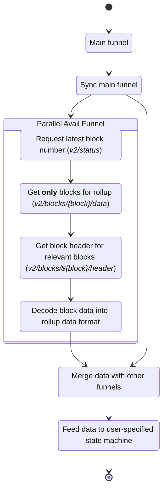

import Search from "./parallel-search.png";

# Avail Parallel funnel

Note that there are two Avail funnels:
- [Avail block funnel](./800-avail-block-funnel.md) for when Avail is the main chain for your app
- [Avail parallel funnel](./700-parallel-avail-funnel.md) for when a different chain is the main chain for your app, and you sync Avail in parallel for extra data

You can learn more about the concept of parallel funnels [here](./1-common-concepts/2-parallel-networks.mdx)

## Configuration

```yaml
Avail:
  type: avail-other
  lightClient: 'http://localhost:7007'
  rpc: ws://127.0.0.1:9944
  delay: 60 
  funnelBlockGroupSize: 100
  genesisHash: "0xdd60847daa1119ecc9bdd006b140087737ac03d260ce110ecd7cb33cf721be35"
```

## Conceptually

This funnel has the following steps:

1. Use the [Avail light
client](https://docs.availproject.org/docs/operate-a-node/run-a-light-client/Overview)
API to get submitted data in a certain block range.
2. Fetch the headers for the blocks that have data. Use this to build a
deterministic mapping from blocks from this chain to the main chain.
3. Fetch the latest block the light client has processed.
4. Merge the submitted data with the one coming from the base funnel by
appending to it.

Here is a visual representation of the flow:



## Finding parallel chain blocks

We achieve this in 2 steps:

### 1) Find key blocks during startup with binary search 

When booting up Paima engine we need to know what's the earliest parallel chain
block whose events might be included in the next main chain block we have to
sync.

Syncing blocks one-by-one until we find these points would be too slow.  To
solve this, we instead use [binary
search](https://simple.wikipedia.org/wiki/Binary_search) to find and cache this
block on boot.

<center>

*Fig*: A binary search looking for the block with a timestamp of 4
</center>

### 2) Fetching blocks in chunks

We fetch parallel chain blocks in chunks of
[funnelBlockGroupSize](./200-configuration.md).  We keep doing this until we
have a block with a timestamp greater than the latest one we've seen from the
main chain.  This allows us to know how to map the parallel chain block number
of any event we find to the right block in the main chain.

