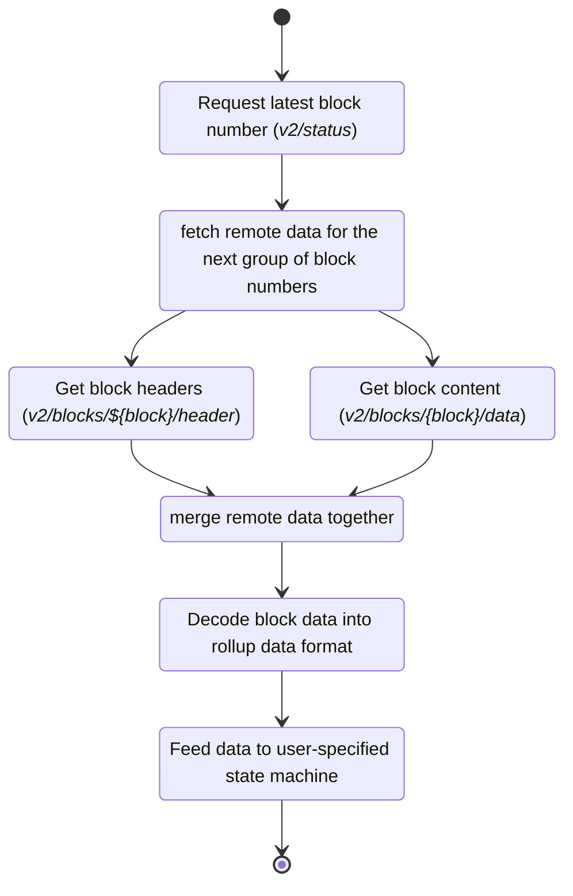

# Avail block funnel

An analogous to the [evm block funnel](./300-block-funnel.md), but for Avail.

Note that there are two Avail funnels:
- [Avail block funnel](./800-avail-block-funnel.md) for when Avail is the main chain for your app
- [Avail parallel funnel](./700-parallel-avail-funnel.md) for when a different chain is the main chain for your app, and you sync Avail in parallel for extra data

## Configuration

```yaml
Avail:
  type: avail-main
  lightClient: 'http://localhost:7007'
  rpc: ws://127.0.0.1:9944
  funnelBlockGroupSize: 100
  presyncStepSize: 1000
  genesisHash: "0xdd60847daa1119ecc9bdd006b140087737ac03d260ce110ecd7cb33cf721be35"
```

## Conceptually

This funnel will do the following:

1. Get the latest block number with verified data availability from the Avail light client through the `v2/status` endpoint. [Reference](https://docs.availproject.org/docs/operate-a-node/run-a-light-client/light-client-api-reference#v2status).
2. Fetch a group of `funnelBlockGroupSize` headers (or less if we're already at the tip).
3. Fetch all the submitted data from the Avail light client through the `v2/blocks/{block_number}/data` endpoint ([reference](https://docs.availproject.org/docs/operate-a-node/run-a-light-client/light-client-api-reference#v2blocksblock_numberdatafieldsdataextrinsic)). This means full blocks are never processed, because the light client can filter by app id.
4. Use `TextDecoder` to read the binary input as text, and continue with the Paima concise format processing.

Note that this means we download blocks from Avail *even if* they are not related to our rollup, as we use the Avail blockchain as the clock for our application.

Here is a visual representation of the flow:


